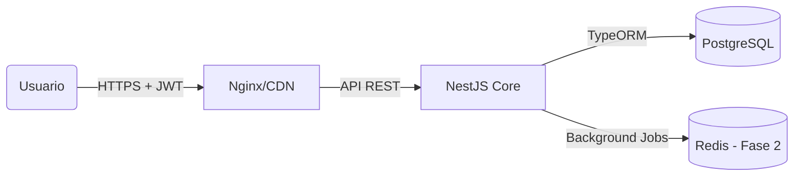

# 🏗️ ARQUITECTURA DEL SISTEMA MOMENTUS
### Documento de Ingeniería de Software (v1.3)

> **Resumen Ejecutivo:** Momentus es una plataforma de gestión operativa de alto rendimiento diseñada bajo principios de **Arquitectura Hexagonal** simplificada (Clean Architecture). Prioriza la integridad de datos, la seguridad granular y la experiencia de usuario (UX) fluida. Está construida para escalar desde equipos de 10 personas hasta corporaciones de 5,000+.

---

## 1. 🔄 Flujo de Alto Nivel
El sistema sigue un flujo unidireccional estricto para garantizar previsibilidad y facilidad de auditoría.

### Componentes Clave:
1.  **Frontend (PWA):**
    - **Tecnología:** React 18, Vite, TypeScript.
    - **Estilo:** TailwindCSS (Diseño Atómico, Responsive).
    - **Estado:** Context API (Ligero, sin Redux innecesario).
    - **Offline-First:** Capacidad de PWA para funcionar con red intermitente.

2.  **Backend (API):**
    - **Tecnología:** NestJS (Node.js Enterprise Framework).
    - **Seguridad:** Passport (JWT), Guards, Pipes de Validación.
    - **ORM:** TypeORM con DTOs estrictos (`class-validator`).

3.  **Datos (Persistencia):**
    - **Motor:** PostgreSQL 15+.
    - **Modelo:** Relacional Normalizado (3NF).

---

## 2. 🛡️ Modelo de Seguridad y Permisos
La seguridad no es un "añadido", es el núcleo del diseño.

### A. Autenticación (¿Quién eres?)
- **JWT (JSON Web Tokens):** Sin estado (Stateless). El servidor no gasta memoria recordando sesiones.
- **Expiración:** Tokens de corta vida con rotación (Refresh Tokens en roadmap).

### B. Autorización (¿Qué puedes hacer?)
Implementamos un sistema híbrido **RBAC** (Roles) + **ABAC** (Atributos/Propiedad).

| Capa | Mecanismo | Ejemplo |
| :--- | :--- | :--- |
| **Nivel 1** | **Guard Global** | ¿Tienes un Token válido? Si no, 401. |
| **Nivel 2** | **Roles (RBAC)** | ¿Eres 'Admin'? Acceso a `/admin/*`. |
| **Nivel 3** | **Contexto (Ownership)** | ¿Intentas editar la Tarea #50? El sistema verifica si eres el **Creador** o **Responsable**. Si no, 403 Forbidden. |

> **Anti-Hack:** Protección contra IDOR (Insecure Direct Object Reference) implementada en todos los endpoints críticos (`actualizarTarea`, `resolverBloqueo`).

---

## 3. 💾 Arquitectura de Datos (ERD)
El modelo de datos resuelve problemas complejos de jerarquía y asignación múltiple.

### Entidades Principales:
*   **`OrganizacionNodo`:** Estructura de árbol recursiva (Gerencia -> Departamento -> Área). Permite modelar organigramas infinitos.
*   **`Usuario`:** Perfil único global. Puede tener múltiples roles en distintos nodos.
*   **`Tarea`:** La unidad atómica de trabajo.
*   **`TareaAsignado`:** Tabla intermedia potente.
    - Permite múltiples responsables, observadores o auditores por tarea.
    - Historia de quién tuvo la tarea en cada momento.
*   **`Checkin`:** La "foto diaria" del estado del empleado.

---

## 4. 🚀 Escalabilidad y Rendimiento
¿Cómo manejamos el crecimiento?

1.  **Consultas Optimizadas:**
    - Uso de `Active Record` para operaciones simples.
    - `QueryBuilder` optimizado para reportes complejos (evitamos el problema N+1).
    - Índices en columnas de búsqueda frecuente (`idUsuario`, `fecha`, `estado`).

2.  **Preparado para Fase 2 (Redis):**
    - Puntos de inyección (`TODO: MAIL`) listos para mover notificaciones a colas asíncronas.
    - Caché de reportes gerenciales planificado para reducir carga en BD.

---

## 5. 🎨 UX/UI: Filosofía "Claro Enterprise"
El diseño no es solo cosmético, es funcional.
- **Códigos de Color Semánticos:**
    - 🔴 **Rojo:** Bloqueo / Tarea Crítica (>2 días atraso).
    - 🟠 **Naranja:** Advertencia / Atraso Leve.
    - 🟢 **Verde:** Al día / Trabajando.
    - ⚪ **Gris/Blanco:** Neutral / Futuro.
- **Tipografía:** Sans-serif limpia para lectura rápida de datos densos.

---

**Conclusión Técnica:**
Momentus v1.3 es un sistema "Enterprise-Grade" listo para producción. Su código es mantenible, tipado estáticamente (TypeScript estricto) y documentado, minimizando la deuda técnica a largo plazo.
