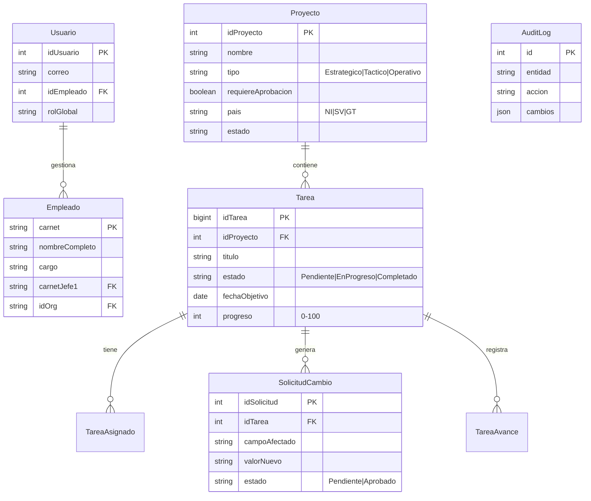

# 🗄️ Base de Datos Maestra: Clarity

Este documento detalla la estructura física y lógica de la base de datos PostgreSQL, incluyendo relaciones críticas y ejemplos de datos vivos.

---

## 1. Diagrama Entidad-Relación (ERD)



---

## 2. Diccionario de Datos Detallado

### A. Módulo Planning (`p_*`)

#### `p_Proyectos`
Tabla maestra de contenedores de trabajo. Define las reglas del juego.

| Campo | Tipo | Obligatorio | Descripción | Ejemplo Real |
|-------|------|-------------|-------------|--------------|
| `idProyecto` | Serial | ✅ | PK Auto-incremental | `105` |
| `nombre` | Varchar | ✅ | Nombre descriptivo | `Optimización Soporte Q1` |
| `tipo` | Varchar | ✅ | Define reglas de gobernanza | `'ESTRATEGICO'` (Bloqueado) o `'TACTICO'` (Libre) |
| `pais` | Varchar(2) | ✅ | Aislamiento de datos | `'NI'` (Nicaragua) |
| `requiereAprobacion`| Bool | ✅ | Switch maestro de candados | `true` |
| `idNodoDuenio` | Int | ❌ | FK a estructura organizacional | `52` (Gerencia RRHH) |

#### `p_Tareas`
Unidad atómica de trabajo. Es una "Smart Task" con ciclo de vida.

| Campo | Tipo | Desc | Ejemplo Real |
|-------|------|------|--------------|
| `idTarea` | BigInt | PK | `50021` |
| `titulo` | Varchar | Título accionable | `Levantamiento de Perfiles IT` |
| `estado` | Varchar | Status | `'En Progreso'` |
| `prioridad`| Varchar | SLA | `'Alta'` |
| `fechaObjetivo`| Date | Deadline | `'2026-02-15'` |
| `progreso` | Int | % Avance | `45` |

#### `p_SolicitudCambios`
Cola de peticiones cuando un usuario intenta modificar un proyecto restringido.

| Campo | Tipo | Desc | Ejemplo Real |
|-------|------|------|--------------|
| `idSolicitud`| Serial | PK | `8` |
| `idTarea` | BigInt | FK Tarea | `50021` |
| `usuarioSolicitante` | Int | FK Usuario | `45` (Josue Garcia) |
| `campoAfectado` | Varchar | Qué quiere cambiar | `'fechaObjetivo'` |
| `valorAnterior` | Varchar | Snapshot | `'2026-02-15'` |
| `valorNuevo` | Varchar | Propuesta | `'2026-02-20'` |
| `motivo` | Text | Justificación | `'Proveedor retrasó entrega'` |
| `estado` | Varchar | Status Flujo | `'Pendiente'` |

---

## 3. Ejemplos de Datos Vivos (JSON)

### Ejemplo 1: Un Proyecto Estratégico (Requiere Aprobación)
```json
// SELECT * FROM p_Proyectos WHERE id = 101
{
  "idProyecto": 101,
  "nombre": "Transformación Digital RRHH 2026",
  "tipo": "ESTRATEGICO",
  "requiereAprobacion": true,
  "pais": "NI",
  "nodoDuenio": {
    "nombre": "Gerencia General RRHH" // Juan Ortuño
  }
}
```

### Ejemplo 2: Tarea Bloqueada (Hija del Proyecto 101)
```json
// Esta tarea NO se puede editar directamente por el usuario operativo
{
  "idTarea": 5055,
  "idProyecto": 101,
  "titulo": "Implementación Módulo Nómina",
  "fechaObjetivo": "2026-03-01", // 🔒 Campo protegido
  "asignado A": "Gustavo Lira"
}
```

### Ejemplo 3: Petición de Cambio (Flow)
```json
// INSERT INTO p_SolicitudCambios
{
  "idTarea": 5055,
  "usuarioSolicitante": "gustavo.lira@...",
  "campoAfectado": "fechaObjetivo",
  "valorActual": "2026-03-01",
  "valorNuevo": "2026-03-15",
  "motivo": "Retraso en validación bancaria",
  "estado": "PENDIENTE" // Aparecerá en Dashboard de Juan Ortuño
}
```

---

## 4. Notas Técnicas para el Desarrollador
1.  **Aislamiento por País:** Todas las consultas a `p_Proyectos` **DEBEN** incluir `WHERE pais = user.pais`. Esto se maneja en el Service, pero es crítico no olvidarlo en queries crudos.
2.  **Lógica del Candado:** El frontend comprueba `proyecto.tipo === 'ESTRATEGICO'`. Si es true, deshabilita inputs de fecha y muestra botón "Solicitar Cambio".
3.  **Auditoría Automática:** Para proyectos `'OPERATIVO'`, cualquier UPDATE dispara un trigger (o lógica en servicio) que inserta en `p_auditoria`.
