# 🌳 Estructura Jerárquica de RRHH (Interpretada)

Este documento detalla cómo el sistema "entiende" la jerarquía de los empleados importados, basándose en los campos `nom_jefe1` (Supervisor Directo) y `nom_jefe2` (Gerente de Área) del archivo CSV.

## 📊 Organigrama Visual (Mermaid)

```mermaid
graph TD
    %% Estilos
    classDef director fill:#000,stroke:#333,stroke-width:2px,color:#fff;
    classDef subgerente fill:#bbf,stroke:#333,stroke-width:2px;
    classDef coordinador fill:#dfd,stroke:#333,stroke-width:1px;
    classDef staff fill:#fff,stroke:#333,stroke-width:1px,stroke-dasharray: 5 5;

    %% Nivel 1: Gerencia General RRHH
    JO[JUAN CARLOS ORTUÑO<br/>Gerente General RRHH]:::director

    %% Nivel 2: Subgerencias (Reportan a Juan Ortuño)
    JO --> NP[NELSON PEREZ<br/>Subg. Rel. Laborales]:::subgerente
    JO --> SM[SERGIO MARTINEZ<br/>Subg. Capacitación]:::subgerente
    JO --> AE[AURORA ESPINOZA<br/>Subg. Compensaciones]:::subgerente

    %% RAMA 1: STAFF GERENCIA (Juan Ortuño)
    subgraph "Staff Gerencia"
        JO --> CS[CÁNDIDA SÁNCHEZ<br/>Coord. Soporte]:::coordinador
        JO --> JT[JAVIER TORUÑO<br/>Coord. RRHH]:::coordinador
        JO --> AR[ALI RODRÍGUEZ<br/>Sup. Flota]:::coordinador
        
        %% Staff de Cándida
        CS --> GL[Gustavo Lira<br/>Analista Soporte]:::staff
        
        %% Staff de Javier
        JT --> MR[Mario Rios<br/>Nómina]:::staff
        JT --> JUV[Juana Urbina<br/>Auxiliar]:::staff
        
        %% Staff de Ali
        AR --> PC[Pablo Cruz]:::staff
        AR --> RD[Ramón Díaz<br/>Conductor]:::staff
        
        %% Directos de Juan Ortuño
        JO --> TA[Tania Aguirre]:::staff
        JO --> JG[Josue García]:::staff
    end

    %% RAMA 2: RELACIONES LABORALES (Nelson Pérez)
    subgraph "Relaciones Laborales & H&S"
        NP --> AD[ANDRÉS DUQUE<br/>Coord. Higiene y Seg.]:::coordinador
        NP --> IH[ISLENY HERNANDEZ<br/>Coord. SST]:::coordinador
        
        %% Staff Andrés
        AD --> MA[María Aracelly]:::staff
        AD --> EN[Erick Nicolás]:::staff
        
        %% Directos Nelson
        NP --> MRO[Marlene Rosales]:::staff
        NP --> NU[Néstor Urbina]:::staff
        NP --> MS[María Victoria]:::staff
    end

    %% RAMA 3: CAPACITACIÓN (Sergio Martínez)
    subgraph "Desarrollo Humano"
        SM --> BC[BELKIS CASTELLÓN<br/>Coord. Capacitación]:::coordinador
        
        %% Staff Belkis
        BC --> SS[Steven Sequeira]:::staff
        BC --> HG[Harry Guevara]:::staff
        BC --> BM[Bryam Martínez]:::staff
        BC --> KD[Keyla Dávila]:::staff
        
        %% Staff Directo Sergio (o asignados a Coord pero reportan distinto en papel?)
        SM --> JZ[Jilma Zelaya]:::staff
        SM --> AH[Allan Hernández]:::staff
        SM --> RM[Rolando Marenco]:::staff
        SM --> MV[Milcy Velásquez]:::staff
    end

    %% RAMA 4: COMPENSACIONES (Aurora Espinoza)
    subgraph "Compensaciones & Reclutamiento"
        AE --> YM[YESENIA MANZANAREZ<br/>Coord. Reclutamiento]:::coordinador
        
        %% Staff Yesenia
        YM --> ARL[Arlen Rivera]:::staff
        YM --> FV[Francis Villarreal]:::staff
        YM --> KB[Kevin Barahona]:::staff
        
        %% Directos Aurora (Compensaciones)
        AE --> LU[Linda Urbina]:::staff
        AE --> MM[Martha Morales]:::staff
        AE --> KT[Kevin Torrez]:::staff
        AE --> SV[Scarleth Vivas]:::staff
    end
```

---

## 📋 Desglose por Equipos

### 1. Gerencia General RRHH (Líder: Juan Ortuño)
Este es el equipo "Core" y de Liderazgo Estratégico.
- **Alcance:** Juan Ortuño ahora supervisa TODAS las ramas (Legal, Desarrollo, Talento).
- **Líderes Clave:** Cándida Sánchez (Soporte Técnico), Javier Toruño (Administración), Ali Rodríguez (Transporte).
- **Personal Clave:** **Gustavo Lira** (Adminsitrador del Sistema) reporta a Cándida.

### 2. Equipo Legal y Seguridad (Líder: Nelson Pérez)
Enfocado en normativa legal, higiene y seguridad ocupacional.
- **Líderes Clave:** Andrés Duque y Isleny Hernández.
- **Estructura:** Mixta, con personal operativo (SST) y administrativo letrado (Abogados).

### 3. Equipo Desarrollo (Líder: Sergio Martínez)
Enfocado en Capacitación y Clima.
- **Líderes Clave:** Belkis Castellón.
- **Observación:** Tiene un equipo grande de especialistas de capacitación (TyC).

### 4. Equipo Talento (Líder: Aurora Espinoza)
Enfocado en Reclutamiento y Pagos (Compensaciones).
- **Líderes Clave:** Yesenia Manzanarez (Reclutamiento).
- **Estructura:** Reclutamiento está separado funcionalmente de Compensaciones, aunque ambos reportan a Aurora.

---

## 🛠️ Cómo usa esta estructura el Sistema

1. **Visibilidad de Datos:**
   - **Juan Ortuño** puede ver las tareas de **Cándida**, **Javier**, **Ali** y todos sus subordinados (Gustavo, Mario, Pablo, etc.).
   - **Cándida Sánchez** puede ver las tareas de **Gustavo Lira**, pero NO las de Javier Toruño (son pares).
   - **Gustavo Lira** (como usuario normal) solo vería lo suyo, pero como tiene rol **ADMIN**, ve todo.

2. **Aprobaciones:**
   - Si **Bryam Martínez** pide vacaciones, la solicitud le llega a **Belkis Castellón**.
   - Si **Belkis Castellón** pide vacaciones, le llega a **Sergio Martínez**.

3. **Métricas:**
   - Los dashboards de "Equipo" agregan datos hacia arriba. El dashboard de **Aurora** mostrará KPIs de Reclutamiento + Compensaciones.
